

  
  <h1>WADe - Artist Search</h1>
    <h2>Big Data Retriever</h2>

  
  
  
  
  

   
<h4>
    <a href="youtube">View Demo</a>
   · 
    <a href="https://github.com/isabellla128/BiRt/blob/main/scholarly-html/index.html">Scholarly HTML Report</a>
   · 
    <a href="https://github.com/isabellla128/BiRt/issues">Report Bug</a>
   · 
    <a href="https://github.com/isabellla128/BiRt/issues">Request Feature</a>
  </h4>

 

# :notebook_with_decorative_cover: Table of Contents

-   [About the Project](#star2-about-the-project)
    -   [Diagrams](#camera-diagrams)
    -   [OpenAPI](#book-openapi-specification)
    -   [Tech Stack](#space_invader-tech-stack)
    -   [Features](#dart-features)
-   [Getting Started](#toolbox-getting-started)
    -   [Installation and Access](#installation-and-access)
    -   [Main UseCases](#rocket-main-features)
    -   [Screenshots](#camera-screenshots)
-   [Roadmap](#compass-roadmap)
-   [Contributing](#wave-contributing)
-   [Contact](#handshake-contact)
-   [Acknowledgements](#gem-acknowledgements)
-   [Tags](#label-tags)

## :star2: About the Project

### :camera: Logo

 
  

### :camera: Diagrams

 
  
  
  
  

### :book: OpenAPI Specification

You can find our OpenAPI specification <a href="https://github.com/isabellla128/BiRt/blob/main/swagger.yaml">here</a>.

#### Instructions

-   Head over to the [Swagger Website](https://editor.swagger.io/)
-   Paste the code in [swagger.yaml](https://github.com/isabellla128/BiRt/blob/main/swagger.yaml)
-   Done!

### :space_invader: Tech Stack

  
Client

  <ul>
    <li><a href="https://angular.dev/overview">Angular 19</a></li>
    <li><a href="https://ionicframework.com">Ionic 9</a></li>
    <li><a href="https://d3js.org">d3.js</a></li>
    <li><a href="https://d3plus.org/?path=/docs/introduction--d3plus">d3plus.js</a></li>
    <li><a href="https://aws.amazon.com/pm/serv-s3">Amazon S3</a></li>
  </ul>

  
Server

  <ul>
    <li><a href="https://www.python.org">Python</a></li>
    <li><a href="https://flask.palletsprojects.com/en/stable/">Flask</a></li>
    <li><a href="https://aws.amazon.com/lambda/">Lambda</a></li>
    <li><a href="https://aws.amazon.com/iam/">IAM Roles</a></li>
    <li><a href="https://aws.amazon.com/elasticbeanstalk/">Elastic Beanstalk</a></li>
    <li><a href="https://aws.amazon.com/eventbridge/">Event Bridge</a></li>
    <li><a href="https://aws.amazon.com/cloudwatch/">CloudWatch</a></li>
    <li><a href="https://aws.amazon.com/vpn/">AWS VPN</a></li>
  </ul>

Database

  <ul>
    <li><a href="https://aws.amazon.com/neptune/">Neptune</a></li>
  </ul>

### :dart: features

- Artist Exploration
- Artist Recommendations
- Genre Exploration
- Genre Recommendations
- Advanced Artist and Genre Filters
- Artists Summary Visualization
- Artist and Genre Visualizations
- Detailed Artist and Genre Profiles
- Artists Comparison
- Data Export

## :toolbox: Getting Started

### Guide for ArtistSearch

Welcome to ArtistSearch, the ultimate platform for discovering and exploring artists, music genres, and relationships between them. This guide will help you navigate the application and utilize its features effectively. For a more detailed guide, access the [documenatation](https://github.com/isabellla128/BiRt/blob/main/scholarly-html/index.html).

### Installation and Access

- Access the app through its [website](http://web-artists-project.s3-website.eu-north-1.amazonaws.com).

### Home Page

Upon entering the application, you will find the main navigation options that allow you to explore artists, genres, and detailed analytics about the music industry.

## :rocket: Main Features

### Exploring Artists

The Artists Page allows users to browse a complete list of artists. Users can filter artists based on:
- **Time Period**: Select artists based on their era.
- **Music Genre**: Filter by the genre of music they perform.
- **Country of Citizenship**: View artists based on their nationality.

Clicking on an artist opens a pop-up with detailed information about them. Additionally, users have the option to export the artist's data in RDF format using the dedicated export button.

### Visualizing Artist Relationships

Users can visualize how artists relate to their music genres through an interactive graph. By clicking the designated button, a dynamic visualization is displayed, showing connections between artists and genres.

### Comparing Two Artists

If two artists are selected, a comparison pop-up appears. This feature provides analytical insights into their careers, styles, and similarities, supported by graphical representations.

## Statistical Analysis of Artists

On the same page, users can access summarized insights about the distribution of artists. Three graphical representations display:

- The number of artists **per country**.
- The number of artists **per genre**.
- The number of artists **per decade**.

These visualizations dynamically update according to the applied filters.

## Exploring Music Genres

The Genres Page provides a comprehensive list of music genres. A filtering option allows users to display only genres associated with a specific country. Clicking on a genre reveals more information, including all its subgenres, which can be further explored. Additionally, users have the option to export the genre's data in RDF format using the dedicated export button.

## :rocket: Additional Features

### Intelligent Artist and Genre Recommendations

The platform suggests artists based on their similarities with a given artist, on the artist detail pop-up. The recommendation system considers:

- Artists sharing at least one music genre with the selected artist.
- Artists born within ±5 years of the selected artist.
- Artists from different countries to ensure diversity.

These recommendations help users discover new artists with related styles.

Additionally, on the Genre Page, at the bottom, users can explore two recommendation lists:

- **Recommended Genres**: These are selected based on genres performed by artists who also perform the currently viewed genre.
- **Recommended Artists**: A list of artists who perform the selected genre, allowing users to explore musicians with similar styles.

These additional recommendations enhance the discovery experience, helping users find both new artists and related music genres effortlessly.

## :bulb: Tips for a Better Experience

- **Use Filters**: Narrow down searches efficiently to find relevant artists and genres.
- **Explore Graphs**: Utilize visualizations to understand relationships between artists and genres.
- **Check Recommendations**: Discover new artists based on intelligent filtering.

## :hammer_and_wrench: Troubleshooting

For any issues, ensure you have a stable internet connection. If data appears outdated, allow some time for updates, as the system periodically refreshes its cache.

Thank you for using ArtistSearch! We hope you enjoy discovering new artists and genres.

## :camera: Screenshots

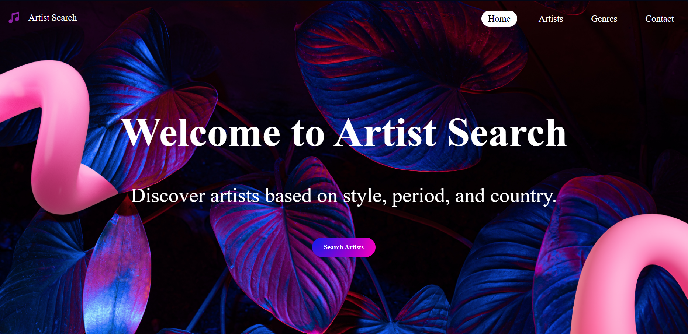
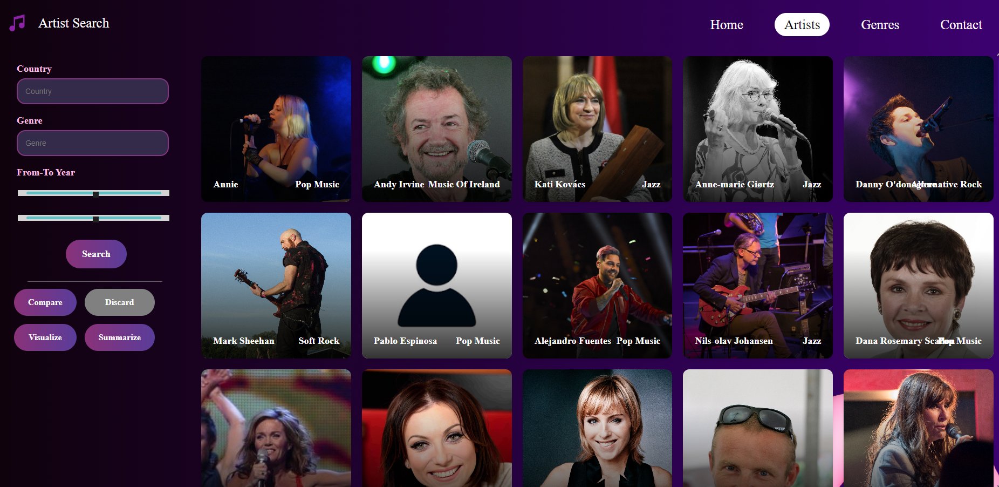
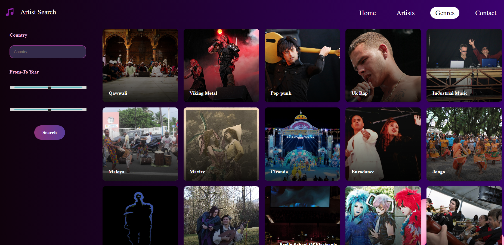
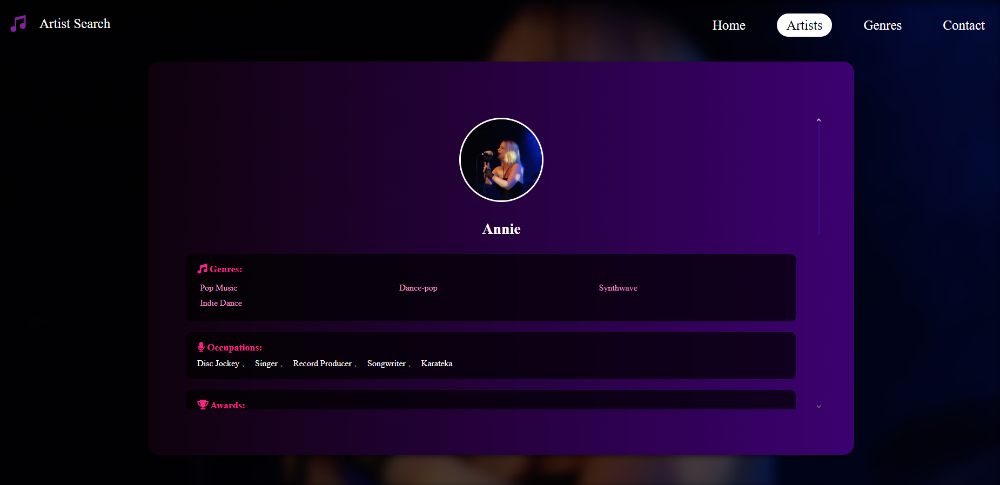
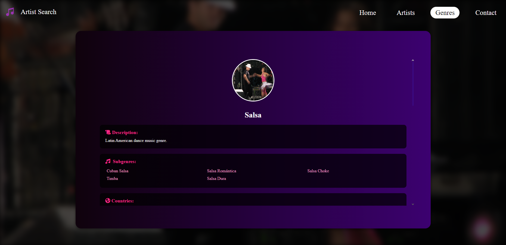
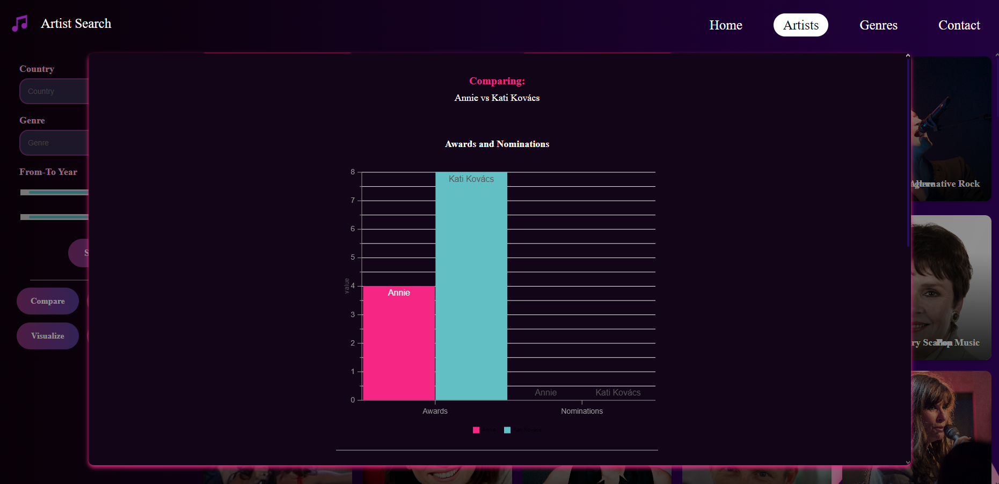
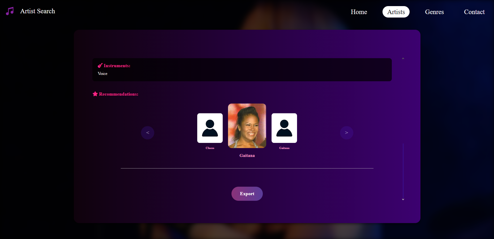
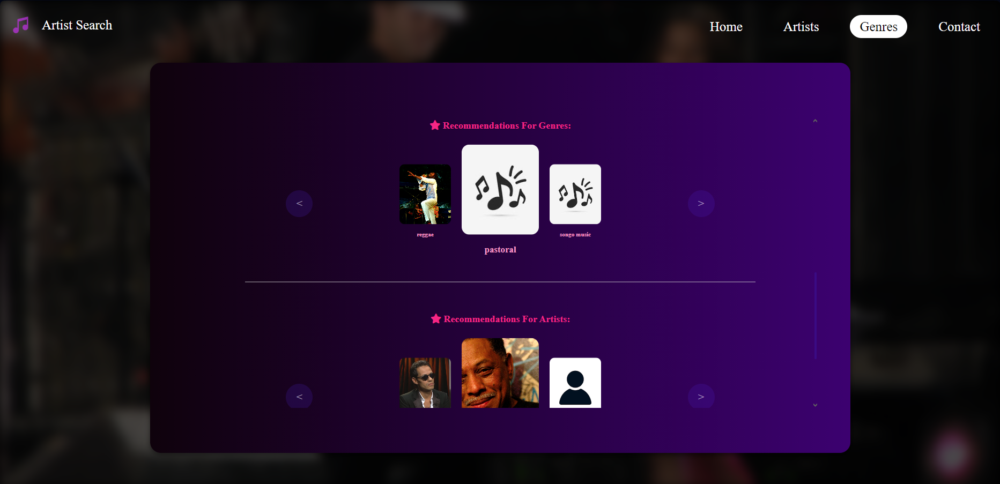
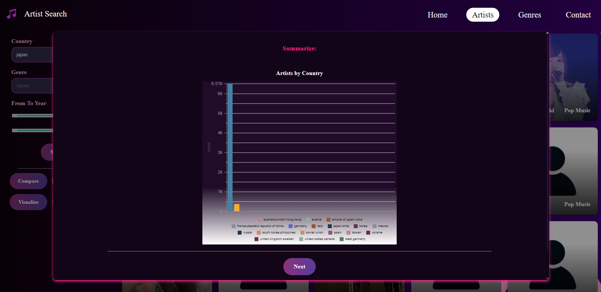
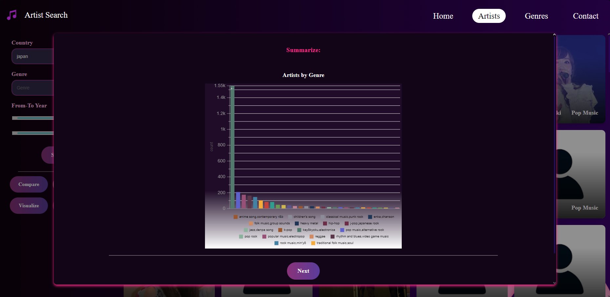
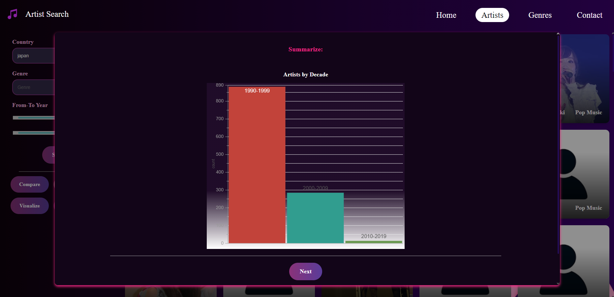
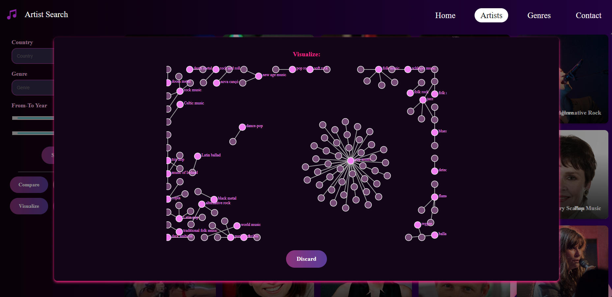
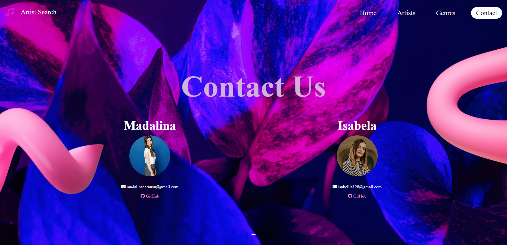

## :camera: Mobile Screenshots

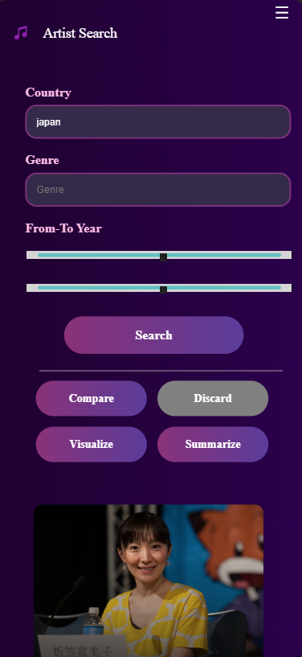
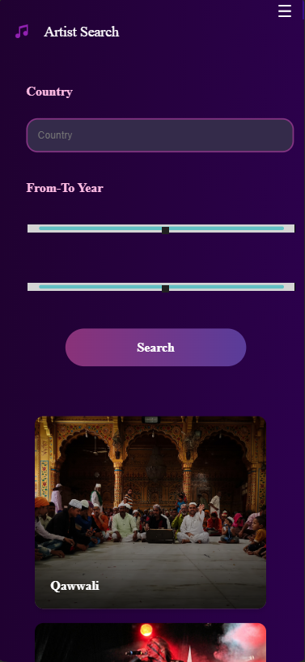
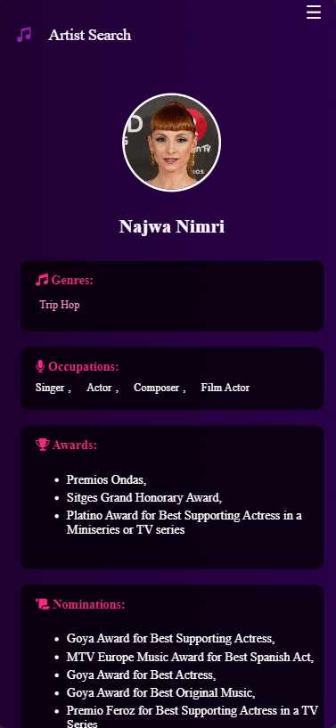
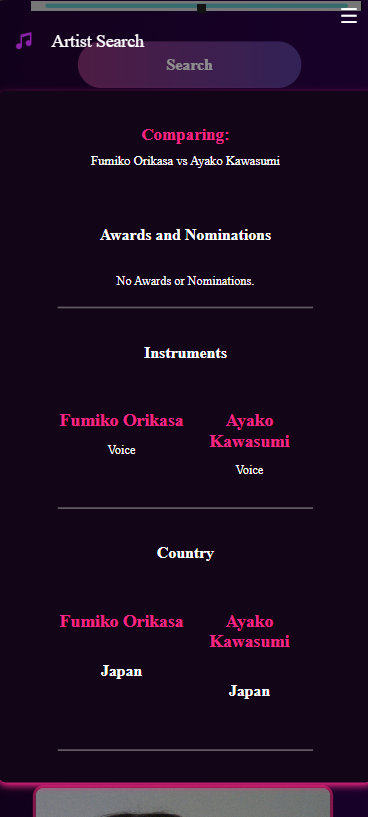
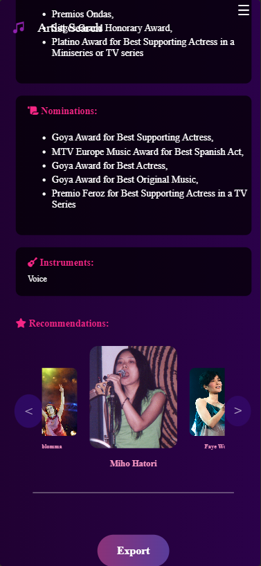
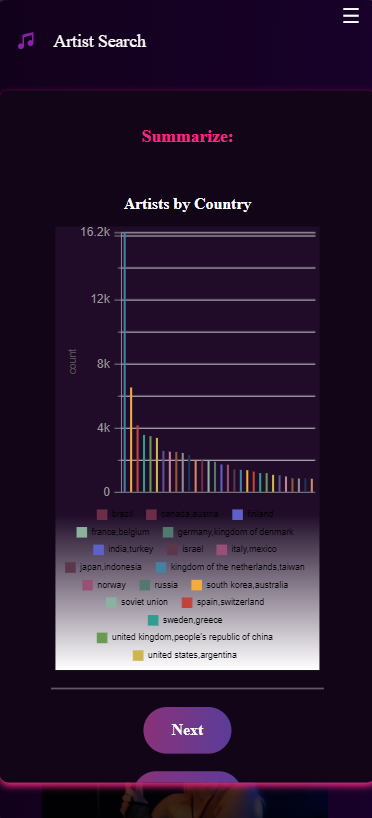
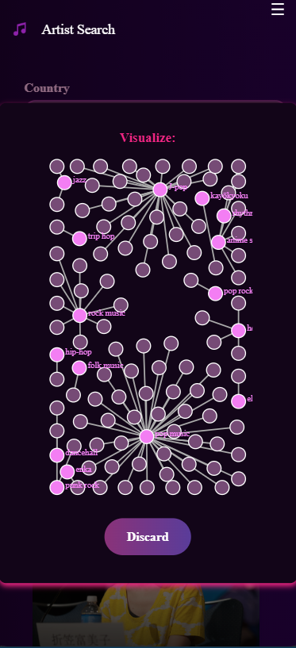
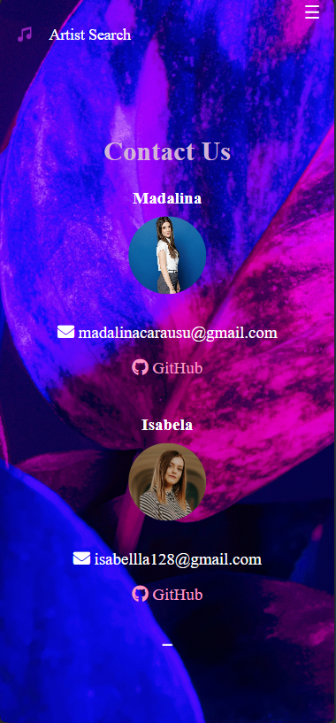

## :compass: Roadmap

-   [x] Phase 1
    -   [x] Initial Project Setup
    -   [x] Data Model Definition
    -   [x] API Endpoint Design
    -   [x] Environment Configuration

-   [x] Phase 2
    -   [x] Data Retrieval Mechanism
    -   [x] Artist Listing Interface
    -   [x] Basic Filtering and Sorting
    -   [x] UI for Artist Display
    -   [x] Database Integration

-   [x] Phase 3
    -   [x]  Artist Profile Details
    -   [x]  Artist Recommendations Engine
    -   [x]  Genre and Country-Based Filters
    -   [x]  Display Enhanced Data for Artists
    -   [x]  Implement Recommendations Based on Similarity

-   [x] Phase 4
    -   [x]  Advanced Filtering System
    -   [x]  Summarization and Data Visualization
    -   [x]  Genre-Based Exploration Features
    -   [x]  Integrating Graphical Insights
    -   [x]  Data Analytics Integration
-  [x] Phase 5
    -   [x]  User Interface Enhancements
    -   [x]  Cross-Device Responsiveness
    -   [x]  Loading Indicators and Smooth UI Transitions
    -   [x]  Final Front-End Polishing
    -   [x]  Comprehensive User Experience Testing
-  [x] Phase 6
    -   [x]  Documentation Completion
    -   [x]  Final Testing and Debugging

## :wave: Contributing

Contributions are always welcome!

## :handshake: Contact

Madalina Carausu - madalinacarausu@gmail.com

Isabela Haiura - isabellla128@gmail.com

## :gem: Acknowledgements

-   [gitmoji](https://gitmoji.dev/)
-   [Readme Template](https://github.com/Louis3797/awesome-readme-template#readme)

### :label: Tags  
`project` `infoiasi` `wade` `web`  `bigdata` `discoverArtists`